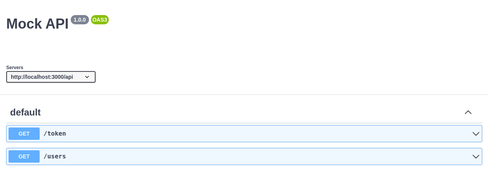
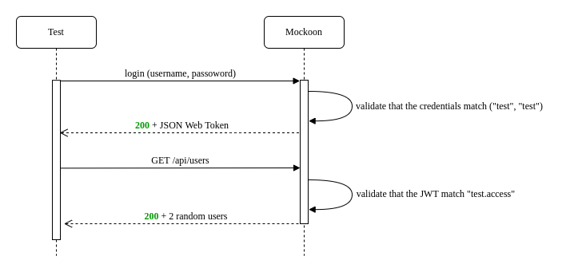
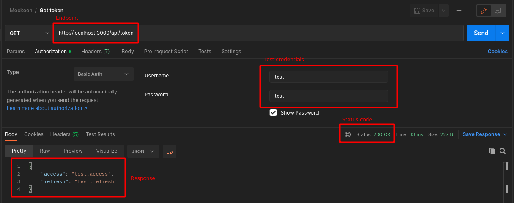
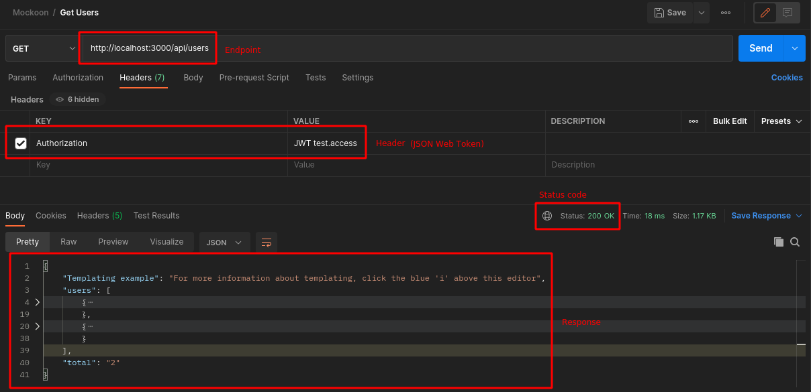
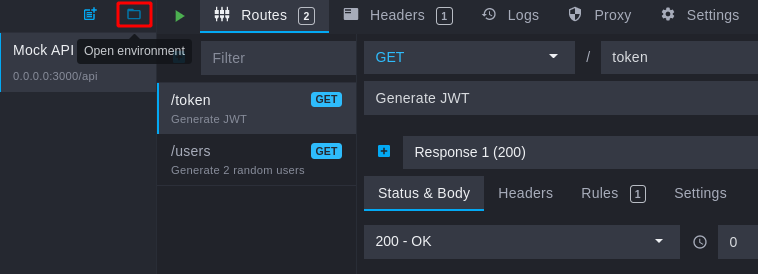
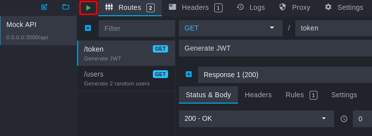

[](https://github.com/prettier/prettier)

# REST API server mock using Mockoon

This project will be used to perform load testing with different tools in my following projects:

- [Base - load testing example using Locust](IN-PROGRESS)

# Table of contents

* [Overview](#overview)
  * [REST API Server mock Endpoints](#rest-api-server-mock-endpoints)
  * [Test Flow](#test-flow)
* [Get started](#get-started)
  * [Requirements](#requirements)
  * [Start mock server](#start-mock-server)
  * [Test mock server](#test-mock-server)
    * [Test credentials](#test-credentials)
    * [Login request](#login-request)
    * [Users data request](#users-data-request)
* [Developers](#developers)
  * [Installation Mockoon](#installation-mockoon)
  * [How to use the sample with Mockoon GUI](#how-to-use-the-sample-with-mockoon-gui)
  * [How to use the sample with Mockoon CLI](#how-to-use-the-sample-with-mockoon-cli)
* [License](#license)

# Overview

In this repository, describes the steps to run a test using a REST API server mock, the test performs a data request
with [JSON Web Token](https://www.rfc-editor.org/rfc/rfc7519) Authentication.

## REST API Server mock Endpoints



## Test flow



The [Developers](#developers) section describes how to modify the mock data and generate your custom cases.

# Get Started

## Requirements

- [Docker +20.10](https://docs.docker.com/engine/install/ubuntu/)
- [docker-compose +1.29](https://docs.docker.com/desktop/install/linux-install/)

## Start mock server

```bash
docker-compose up -d
```

The mock server is now available on http://localhost:3000.

## Test mock server

We will use [Postman](https://www.postman.com/) to test the Endpoints of the REST API Server mock.

### Test credentials

| name           | value         |
|----------------|---------------|
| username       | `test`        |
| password       | `test`        |
| JSON Web Token | `test.access` |

### Login request



## Users data request



# Developers

## Installation Mockoon

Install Mockoon GUI and CLI on your system (`latest version`).

```bash
bash scripts/install_mockoon.sh
```

## How to use the sample with Mockoon GUI

- To **open** the sample JSON file and click on the `Open environment` button and select `./examples/jwt_users/mock_data.json`
  file:
  
- To **edit** the sample: [Mockoon documentation](https://mockoon.com/docs/latest/gui-cheat-sheet/).
- To **run** the mock server press the green button "play":
  

## How to use the sample with Mockoon CLI

To run the mock sample with the CLI you can directly run the following command using the sample JSON file:

```bash
mockoon-cli start --daemon-off --data ./examples/jwt_users/mock_data.json
```

# License

[MIT](./LICENSE)
